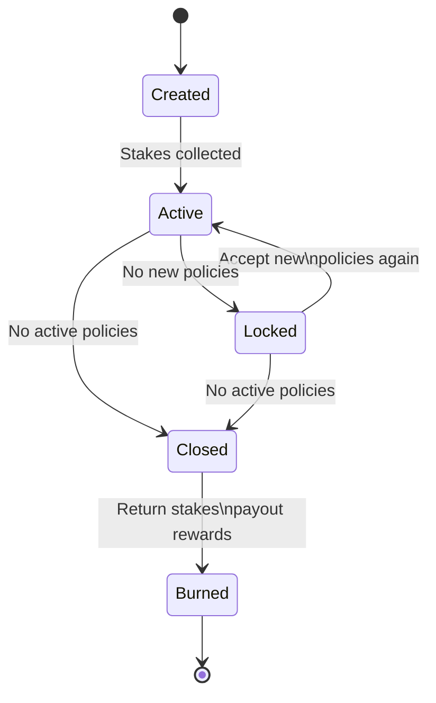

[](https://opensource.org/licenses/Apache-2.0)
[](https://discord.gg/Qb6ZjgE8)

# Depeg Insurance Contracts

This repository holds the smart contracts for a depeg insurance for stable coins.

## Address for Test Goerli ETH
0x0E458906446AfB6fB388b1a5E1cE6598d077dfB5

## Explore Mumbai Setup

Preparation steps:
* Compile contracts
* Start the Brownie console connecting to Mumbai

```bash
brownie compile --all
brownie console --network=polygon-test
```

In the Brownie console run the following commands.
Given the Depeg product address (at the end of the commands) the function `get_setup` "crawls" the relevant deployed contracts and report their current configuration.

The resulting configuration (JSON) is stored in variable `setup`.

```python
from scripts.util import contract_from_address, get_package
from scripts.deploy_depeg import get_setup, contract_from_address

gif = get_package('gif-contracts')
usd1 = contract_from_address(USD1, '0x5B70915CA7De9c21229AE5E18A64f6cF36dc11Fb')
usd2 = contract_from_address(USD2, '0x268131A1A7639F8F918d4a17A74C79209b2C645D')
dip = contract_from_address(DIP, '0x0c3EA45c5290FCCB528109b167A5e66734d2578c')

product_address='0x43687bd425E02E375Dee3D22903878CdbB2eD019'
(setup, product, feeder, riskpool, registry, staking, dip, usdt, instance_service) = get_setup(product_address)

setup
```
## Explore Goerli Setup

Preparation steps:
* Compile contracts
* Start the Brownie console connecting to Mumbai

```bash
brownie compile --all
brownie console --network=goerli
```

In the Brownie console run the following commands.
Given the Depeg product address (at the end of the commands) the function `get_setup` "crawls" the relevant deployed contracts and report their current configuration.

The resulting configuration (JSON) is stored in variable `setup`.

```python
from scripts.util import contract_from_address, get_package
from scripts.deploy_depeg import get_setup, contract_from_address

gif = get_package('gif-contracts')
usd1 = contract_from_address(USD1, '0x00B7cA1167bCc1CfEe30dF946B9C2Df7F36F2fB3')
usd2 = contract_from_address(USD2, '0x6baCCf5b80000fDc3B5925eB65253D0a73aeF882')
dip = contract_from_address(DIP, '0x47678b3aC8336dc3fE390d81ef80593D0c6b28B9')

product_address='0x33A7785D9EEB78e33A9587E9De075aB11A354387'
(setup, product, feeder, riskpool, registry, staking, dip, usdt, instance_service) = get_setup(product_address)

setup
```

## Release new version

- switch to main branch
- merge all changes to main (develop - `git merge develop`)
- increase npm package version (`npm version major|minor|patch`)
- push changes to main (`git push && git push --tags`)
- publish updated npm package (`npm publish`)
- check updated package on https://www.npmjs.com/package/@etherisc/depeg-contracts

## GIF Object Lifecycles

### Application Lifecycle

Product contract functions
* applyForPolicyWithBundleAndSignature (external)
* applyForPolicyWithBundle (external)
* _applyForPolicyWithBundle (internal)

Function `_applyForPolicyWithBundle` internally calls `_underwrite` and requires underwriting to succeed. 

Underwriting via performs the following actions (GIF framework)
* Locking of collateral via pool controller
* Underwriting the application object via policy controller
* Creating an active policy via policy controller
* Collect premium via treasury module
* If premium collection successful: reflect collected premium in policy and riskpool book keeping

In short: A new active policy is created.

Unit tests
```bash
❯ find . | grep '.py$' | xargs grep -n applyForPolicyWithBundleAndSignature | cut -c-120
./tests/test_application_gasless.py:125:        product.applyForPolicyWithBundleAndSignature(customer, protectedWallet, 
./tests/test_application_gasless.py:129:        product.applyForPolicyWithBundleAndSignature(customer2, protectedWallet,
./tests/test_application_gasless.py:133:        product.applyForPolicyWithBundleAndSignature(customer, customer2, protec
./tests/test_application_gasless.py:137:        product.applyForPolicyWithBundleAndSignature(customer, protectedWallet, 
./tests/test_application_gasless.py:141:        product.applyForPolicyWithBundleAndSignature(customer, protectedWallet, 
./tests/test_application_gasless.py:145:        product.applyForPolicyWithBundleAndSignature(customer, protectedWallet, 
./tests/test_application_gasless.py:149:        product.applyForPolicyWithBundleAndSignature(customer, protectedWallet, 
./tests/test_application_gasless.py:153:        product.applyForPolicyWithBundleAndSignature(customer, protectedWallet, 
./tests/test_application_gasless.py:157:        product.applyForPolicyWithBundleAndSignature(customer, protectedWallet, 
./tests/test_application_gasless.py:197:    tx = product.applyForPolicyWithBundleAndSignature(
```

```bash
❯ find . | grep '.py$' | xargs grep -n "applyForPolicyWithBundle(" | cut -c-120
./scripts/deploy_depeg.py:1459:    tx = product.applyForPolicyWithBundle(wallet, sumInsured, duration, bundleId, {'from'
./scripts/setup.py:134:    tx = product.applyForPolicyWithBundle(
./tests/test_product_20.py:241:    tx = product20.applyForPolicyWithBundle(
./tests/test_product_20.py:307:        product20.applyForPolicyWithBundle(
./tests/test_product_20.py:318:        product20.applyForPolicyWithBundle(
./tests/test_product_20.py:329:        product20.applyForPolicyWithBundle(
./tests/test_product_20.py:339:    tx = product20.applyForPolicyWithBundle(
./tests/test_sandbox.py:121:    tx = product.applyForPolicyWithBundle(
```

### Policy Lifecyle

New (active) policies are created in the context of function `_applyForPolicyWithBundle`

Policies go through states `Expired` and `Closed` in slightly different ways that are dependent if there has been a depeg event or not.

In the case of normal expiry without a depeg event/claim, a policy should be explicitly closed to free the locked collateral in the risk pool.
This is achieved via the `close` function that internally expires and closes the policy (via `_expire` and `_close`).

If there is a depeg event and a policy is allowed to claim, the following steps are performed in `createDepegClaim`
* A new claim is created for the policy (via `_newClaim`)
* The policy is expired (via `_expire`)

In a depeg event policies that created a depeg claim can then be processed via the following steps
* Get relevant process ids via (`policiesToProcess`/`getPolicyToProcess`)
* Process individual policies (via `processPolicy`) or batch (via `processPolicies` which internally uses `processPolicy`)

Inside `processPolicy` the following actions are perfomed
* Confirm the claim (via _confirmClaim)
* A new payout is created (via _newPayout)
* The payout is processed (via _processPayout)
* The policy is closed (via _close)

Unit test for expriy/closing without depeg case:
```bash
❯ find . | grep '.py$' | xargs grep -n "close(" | cut -c-120
./tests/test_policy_lifecycle.py:558:        product.close(process_id)
./tests/test_policy_lifecycle.py:565:    tx = product.close(process_id)
```

Unit tests for depeg case
```bash
❯ find . | grep '.py$' | xargs grep -n "createDepegClaim" | cut -c-120
./tests/test_policy_lifecycle.py:262:    tx = product.createDepegClaim(
./tests/test_policy_lifecycle.py:659:    tx = product.createDepegClaim(
./tests/test_policy_lifecycle.py:810:    product.createDepegClaim(process_id1, {'from': protectedWallet})
./tests/test_policy_lifecycle.py:811:    product.createDepegClaim(process_id2, {'from': protectedWallet})
./tests/test_policy_lifecycle.py:812:    product.createDepegClaim(process_id3, {'from': protectedWallet})
./tests/test_product_20.py:438:    tx = product20.createDepegClaim(
./tests/test_product_20.py:576:    tx = product20.createDepegClaim(
```

Unit tests to process claims
```
❯ find . | grep '.py$' | xargs grep -n "policiesToProcess" | cut -c-120
./server_processor/product.py:134:            'policies_to_process': depeg_product.policiesToProcess(),
./tests/test_policy_lifecycle.py:247:    assert product.policiesToProcess() == 0
./tests/test_policy_lifecycle.py:292:    assert product.policiesToProcess() == 1
./tests/test_policy_lifecycle.py:398:    assert product.policiesToProcess() == 0

❯ find . | grep '.py$' | xargs grep -n "getPolicyToProcess" | cut -c-120
./tests/test_policy_lifecycle.py:293:    (pid, wallet) = product.getPolicyToProcess(0)

❯ find . | grep '.py$' | xargs grep -n "processPolicies" | cut -c-120
./tests/test_policy_lifecycle.py:376:    tx = product.processPolicies([process_id])
./tests/test_policy_lifecycle.py:693:    tx = product.processPolicies([process_id])
./tests/test_product_20.py:484:    tx = product20.processPolicies([process_id])
./tests/test_product_20.py:621:    tx = product20.processPolicies([process_id])

❯ find . | grep '.py$' | xargs grep -n "processPolicy" | cut -c-120
./tests/test_policy_lifecycle.py:842:    tx = product.processPolicy(process_id1)
./tests/test_policy_lifecycle.py:849:    tx = product.processPolicy(process_id2)
./tests/test_policy_lifecycle.py:865:        product.processPolicy(process_id3)
```

Missing unit tests for
* policyIsAllowedToClaim

### Bundle Lifecycle


## Product Considerations

### What is insured?

A depeg policy covers the risk of a depeg of stable coin USD1 from the fiat currency USD.

* The insured buys a policy to insure the depeg risk of stable coin USD1.
* In a depeg event the loss amount is payed out in stable coin USD2.
* The risk that stable coin USD2 has depegged at the same time is not covered.

Policy parameters:
* Sum insured amount of X in USD1
* Maximum premium payment of amount Y in USD2 the policy holder is willing to pay
* Actual USD1 funds located at account address Z

### Account/wallet requirements

Only funds at a specific address may be insured.
Insurable accounts

* Externally owned account (EOA)
* Gnosis Safe multisig smart contract

### Depeg event

The depeg definition is based on data provided by the [Chainlink price feed](https://docs.chain.link/docs/data-feeds/price-feeds/) for stable coin USD1.
See [Contract addresses](https://docs.chain.link/docs/data-feeds/price-feeds/addresses/?network=ethereum) for available price feeds.
See [this repository](https://github.com/etherisc/poc-chainlink-pricefeed) for some initial analysis of Chainlink price feeds for stable coins.

The following definition for a deterministic definition of a depeg event may be used.

* A depeg event candidate is created when the USD1 price data falls below a trigger threshold.

* When the USD1 price data recovers at or above a recovery threshold within 24h the depeg event candidate is considered a false alarm and no claims/payouts are created.

* When the USD1 price data does not recover at or above the recovery threshold within 24 hours the depeg event candidate becomes an actual depeg event.

* For the loss calculation the price data 24h after the initial depeg trigger is used.

An inherent risk with the above definition is its Chainlink price feed dependency. 

Chainlink price feeds come with a so called 'Heartbeat' which indicates the maximum time between consecutive price updates even when the price does not change enough to trigger a price update.

As in the case of any off-chain dependency there is a risk that systems do not behave as intended in extraordinary circumstances.

For such cases we are considering the addition of a manual trigger for depeg events.

Such a trigger might only be used when a predefined set of conditions occur.
For the usage of a manual trigger a number of restrictions will apply.
* The latest price update from the chainlink feed is long overdue
* Price data is broken, publically acknowledged by Chainlink
* Calling is restricted to accounts whitelisted by the product owner

### Loss calculation

For the loss calculation the following points are considered.

* The loss is assesed by the %-loss of the USD1 exchange rate against the fiat currency USD. 
* The sum insured might be reduced to the actual balance of the insured account at the time of the loss event
* The loss amount is calulated by the %-loss at the depeg claim event times the sum insured.

### Payout handling

Payouts are made in an alternative stable coin USD2.

* The payout amount calculation is ensured by product management
* Actual payout execution may be triggered by the policy holder
* For a payout a fixed exchange rate 
between the payout stable coin USD2 and the fiat USD of 1.0 is used. 


## Risk Capital Considerations

### Where does the risk capital come from?

The risk capital in USD2 to cover the depeg policies comes from risk investors.
Participation makes sense for risk investors with the following believe system

* Depeg risk of USD1 over the coming 3 to 6 months is neglegible
* Availability of USD2 funds
* Interest to make some income by locking USD2 funds into a riskpool

### How is the risk premium determined?

The risk investor defines the annual percentage return she/he is asking for covering the depeg risk.
This annual percentage return asked by the risk investor directly translates into policy net premium amounts.

Risk investors might want to consider the following aspects before fixing their annual percentage return for the provided risk capital.

* The more policies covered, the more return (net premiums - claim payouts)
* The higher the policy premiums, the more return
* Setting the annual percentage return very high will likely lead to very few covered policies
* Setting the annual percentage return very low will likely lead to many covered policies with a low total net premium
* Finding the sweet spot for the annual percentage return will lead to the highest return on the risk capital.

### How to invest risk capital for the depeg insurance

Investing risk captial can be achieved by providing risk captial to the depeg risk pool.

* Risk investors need to fix their risk parameters (e.g. annual percentage return) and provide risk capital to the risk pool in stable coin USD2.
* When investing in the risk pool the risk investor gets a risk bundle NFT that represents the invested USD2 capital.
* Once the risk bundle is created the risk capital needs to be unlocked by staking DIP token against the bundle.
* Only risk capital that is unlocked by DIP staking may be available to cover depeg policies and collect potential return on the risk capital.

## Staking Considerations

### Intro

At the highest level the holder of some staking token (DIP in this use case)
locks some of her/his token in a smart contract for some time to support the  ecosystem and to get some rewards (DIP tokens in this use case).

The sustainable source for such rewards in the GIF context comes from platform fees that are collected while selling insurance policies.

### Comparison of validator and riskpool staking

To get into staking and delegated staking in the GIF context it might be helpful to compare the widely used validator staking with the GIF specific riskpool staking.

The context of the depeg product is even more specific in the sense that
the current staking concept for the depeg insurance links staking with individual risk bundels that are funded by risk captial providers (ie the investors).

| Topic           | "Classical" case | Depeg insurance |
|-----------------|------------------|-----------------|
| Staking target | Validator | Riskpool bundle |
| Purpose | Needs staked token to be considered to validate TX | Needs staked token to be able to cover policies with locked risk capital |
| More staking | Increases likelyhood to validate blocks and win rewards | Unlockes more of the risk capital to cover more policies
| Reward source | TX fees and freshly minted token | Fraction of platform fees linked to riskpool bundle (converted to DIP token)
| Payout event | For each validated block | When riskpool bundle is burned
| Slashing | When validator misses slots or misbehaves | No slashing, GIF ensures that bundle owner cannot act in any malicious way

### Staking and delegated staking

For the purpose of the depeg insurance the only difference between staking and delegated staking is who ownes the staked DIP token. 

The envisioned process to stake or to do delegated staking is as follows.

1. The risk capital investor creates a risk bundle and funds the bundle with USD2
1. DIP token holders which might or might not be risk capital investors choose an active riskpool bundle and stake DIP to unlock risk capital invested in the bundle.
1. The rate of staked DIP to unlocked USD2 is fixed. Therefore, the amount of DIP that can be staked to a riskpool bundle is capped by the amount of USD2 token associated with a riskpool bundle.

A likely scenario is to reserve a fraction of the staking volume to whitelisted DIP holders for a certain time to honor their early support and investment in the eco system. 

### Implications on bundle life cycle

The bundle life cycle needs a staking phase to unlock the provided risk capital to collateralize policies.
Such a staking phase can be defined by an additional bundle state `Created` prior to the `Active` state.




While in created state a bundle collects stakes that enable the provided capital to collateralize policies.
While a bundle is `Created` state anybody (including the bundle owner) with DIP tokens may stake DIP on a bundle in state `Created`.

### Contract setup

Staking tracked and managed by a separate contract outside of any GIF instance.
As staking provides utility to DIP it should be managed in a central place outside a specific GIF instance.

Potentially the staking contract(s) could live on mainnet and keep track of what address staked how much on which instance on what. 

In this use case staking is defined for bundles only so far.

## Staking using Liquidity Mining

Staking in the DIP ecosystem could be kick started with liquidity mining only.
DIP holders could stake DIP on active bundles.
Staked DIP would then earn some percentage of DIP per year on a pro rata base.

Would allow for staking/unstaking at any time.
Bookkeeping of pro rata staking rewards would be simple to implement.

Such an approach would work without any fee collection book keeping and
could kick start staking in the DIP ecosystgem.

### Staking Contract

Staking contract on mainnet

### Staker API

* `function stake(bytes32 instanceId, uint256 bundleId, uint256 amount)`
* `function withdraw(bytes32 instanceId, uint256 bundleId, uint256 amount)`
* `function balanceOf(address staker, bytes32 instanceId, uint256 bundleId)`

### Maintenance API

* `function syncBundleState(address instanceRegistryAddress)`

## Github actions

Only go through the process described here if an updated GIF is required for the deployment test.

### Update Ganache DB for deployment test

Start a local ganache with db folder

```bash
rm -rf .github/workflows/ganache-gif/
ganache-cli \
    --mnemonic "candy maple cake sugar pudding cream honey rich smooth crumble sweet treat" \
    --chain.chainId 1234 \
    --port 7545 \
    --accounts 20 \
    -h "0.0.0.0" \
    --database.dbPath .github/workflows/ganache-gif/
```
In new shell run the following commands

```bash
brownie networks add Local ganache-ghaction host=http://localhost:7545 chainid=1234
cd /gif-contracts
rm -rf build/
brownie console --network=ganache-ghaction
```

Now paste this into the brownie console

```python
from brownie import TestCoin
instanceOperator = accounts[0]
instanceWallet = accounts[1]
usdc = TestCoin.deploy({'from': instanceOperator})
from scripts.instance import GifInstance
instance = GifInstance(instanceOperator, instanceWallet)
print('registry {}\nerc20 {}'.format(
    instance.getRegistry().address,
    usdc.address))
```

Now shutdown above started Ganache chain (ctrl+c) and commit the new files to git. 

Also save the values for registry and erc20 in `scripts/test_deployment.py`. 

## Depeg monitor

The code for the depeg monitor is in `server`. It exposes a FastAPI api at `/docs`.

### Deployment

The Dockerfile to run the depeg monitor is `Dockerfile.depeg-monitor`. It requires these environment variables to be set:

```bash
APPLICATION_TITLE = "Depeg API Monitoring"
APPLICATION_VERSION = 1.0
APPLICATION_DESCRIPTION = "API Server to Monitor and access price feed data"

LOGGING_FORMAT="<green>{time:YYYY-MM-DD HH:mm:ss.SSS}</green> | <level>{level: <8}</level> | <cyan>{file}</cyan>:<cyan>{line}</cyan> <cyan>[{name}.{function}]</cyan> - <level>{message}</level>"
LOGGING_LEVEL="INFO"

# only for neworks that use fake price feeder like mumbai
FEEDER_INTERVAL=60
checker_interval=30

# web3 coordinates
PRODUCT_CONTRACT_ADDRESS="0xa93CE853aAD898cd04547EEceAf48dBA93A70b97"
# only on test chains
PRODUCT_OWNER_MNEMONIC=
PRODUCT_OWNER_OFFSET=
# on all chains
MONITOR_MNEMONIC=

NODE__NETWORK_ID=
WEB3_INFURA_PROJECT_ID=
```

Dokku deployment steps

Checking current setup on cloud server

```bash
dokku apps:list
dokku apps:report <app-name>
dokku domains:report <app-name>
dokku config:show <app-name>
```

Push/deploy current state form local repo
```bash
git push <remote-repo> <local-branch>:main
git push dokku-mainnet main:main
```

Set and check env variables on cloud server. 

```bash
dokku config:set <app-name> name=value
dokku config:show <app-name>
dokku logs -t <app-name>
```
To remove an unused env variable use `dokku config:unset <app-name> key1 [key2 ...]`
